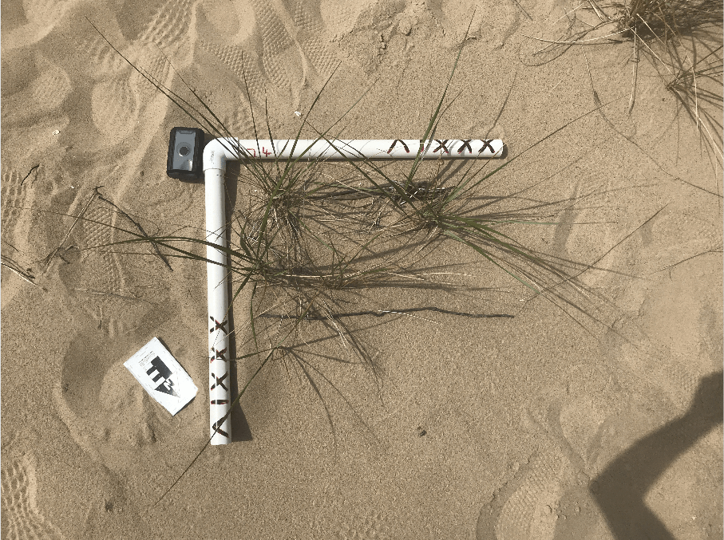
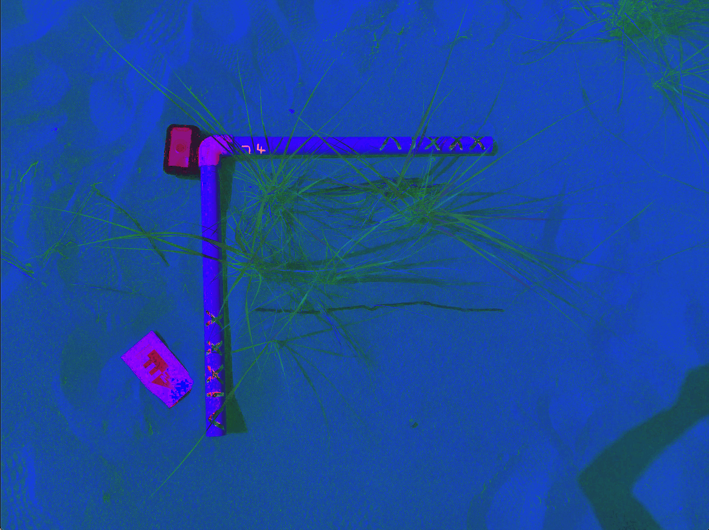
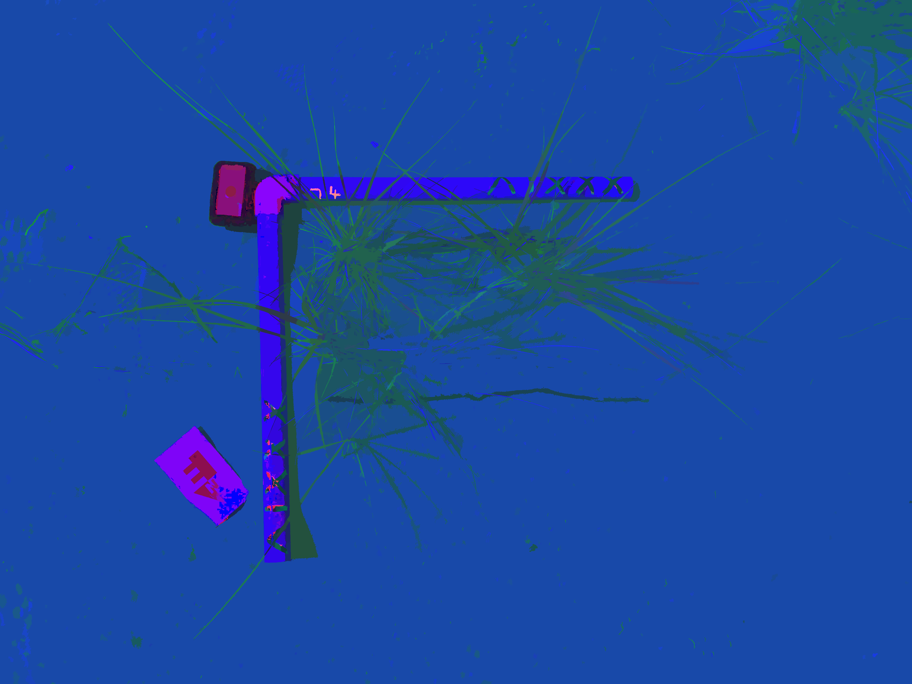
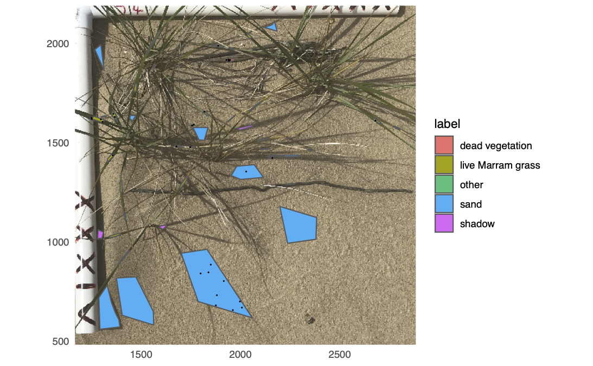
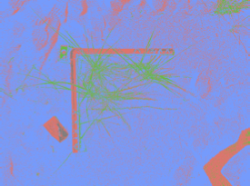

# Pixel Based Classification of Photographs

## Problem

Classify pixels in 50 photographs that include the same classes.

For this particular project, the goal is to classify photographs taken over a coastal dune complex as live vegetation, dead vegetation, sand, etc to estimate vegetation density.

## Requirements

R, Python, [Labelme](https://github.com/wkentaro/labelme)

## Workflow

The data and outputs from the workflow are stored in directories [_raw_data_](https://drive.google.com/drive/folders/1l1CO1KsPGKZGpAvzJdguCbW4ApAUYwWh?usp=sharing), [_clean_data_](https://drive.google.com/drive/folders/1l1KwdsH1Q0T0ZGWL48JJ_RwQdiLgHLqb?usp=sharing), and [_outputs_](https://drive.google.com/drive/folders/1l26MWxEQS57XVOoJ3nvv0cozci1TUNpf?usp=sharing). Note that these three directories are ignored by git. The code that manipulates the data are in the code directory.

### Directory Structure

- **raw_data:** untouched collected images, etc.
- **clean_data:** organized data including original images, features images, and polygons drawn using [labelme](https://github.com/wkentaro/labelme).
- **outputs:** any generated data to view or take on to future projects.
- **code:**  scripts and markdown documents to process and manipulate images and to create training sets.

### Extract Features

The original images are taken with a regular RGB camera. Note that in each photograph there is a 2'x2' PVC **quadrat** used for area identification. Different processes are used to extract features from the RGB photograph to increase the accuracy of our classifier. These techniques include calculating texture measurements with the [Grey Level Co-Occurrence Matrix](https://prism.ucalgary.ca/handle/1880/51900) (GLCM), transforming the RGB image into different [color spaces](https://towardsdatascience.com/understand-and-visualize-color-spaces-to-improve-your-machine-learning-and-deep-learning-models-4ece80108526) (ex HSV), and  [image segmentation](https://github.com/fjean/pymeanshift).

<table cellpadding='0' border='0' align='center' cellspacing='0' width='75%'>
<tr cellpadding='0' cellspacing='0'>
<td cellpadding='0' align='center' cellspacing='0'><b>Original image</b></td>
<td cellpadding='0' align='center' cellspacing='0'><b>HSV image (plotted as RGB)</b></td>
</tr>
<tr cellpadding='0' cellspacing='0'>
<td cellpadding='0' align='center' cellspacing='0' valign='top'>

</td>
<td cellpadding='0' align='center' cellspacing='0'>

</td>
</tr>
</table>

<table cellpadding='0' border='0' align='center' cellspacing='0' width='75%'>
<tr cellpadding='0' cellspacing='0'>
<td cellpadding='0' align='center' cellspacing='0'><b>Texture image</b></td>
<td cellpadding='0' align='center' cellspacing='0'><b>HSV Segmented image (plotted as RGB)</b></td>
</tr>
<tr cellpadding='0' cellspacing='0'>
<td cellpadding='0' align='center' cellspacing='0' valign='top'>

</td>
<td cellpadding='0' align='center' cellspacing='0'>

</td>
</tr>
</table>

### Sample Pixels

Using [labelme](https://github.com/wkentaro/labelme), polygons were drawn over the images and labeled into classes. These polygons were split into three sets and pixel values from the feature images were extracted. We use 50% of the polygons for training,  30% for validation, and 20% as a final test to determine the accuracy of the classifier. 

<table cellpadding='0' border='0' align='center' cellspacing='0' width='50%'>
<tr cellpadding='0' cellspacing='0'>
<td cellpadding='0' align='center' cellspacing='0'><b>Sampled Pixels in a Single Image</b></td>

</tr>
<tr cellpadding='0' cellspacing='0'>
<td cellpadding='0' align='center' cellspacing='0'>

</td>
</tr>
</table>

### Train Classifier

The [Random Forest](https://link.springer.com/article/10.1023/A:1010933404324) machine learning alogrithm is used to classify all 50 photographs.

### Classified Image Example

Here is an example of a classified image, made up of three different classes. For this project we are only concerned with the area inside the PVC quadrat so the resulting class becomes irrelevant.

<table cellpadding='0' border='0' align='center' cellspacing='0' width='50%'>
<tr cellpadding='0' cellspacing='0'>
<td cellpadding='0' align='center' cellspacing='0'><b>Exampled of a Classified Image</b></td>

</tr>
<tr cellpadding='0' cellspacing='0'>
<td cellpadding='0' align='center' cellspacing='0'>

</td>
</tr>
</table>

In this particular problem we used the classified images to estimate vegetation density.  We take these vegetation density estimates and create a regression model with imagery taken with a drone to calculate vegetation density across an entire dune complex.
# jackkrebsbach
